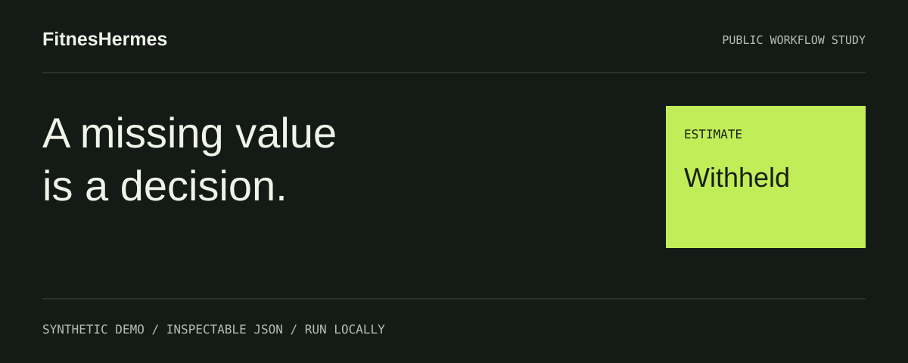
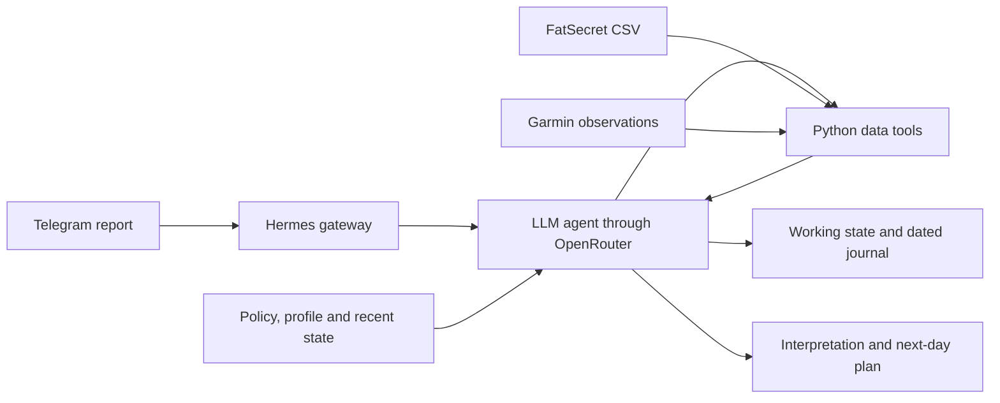

# FitnesHermes

[](https://daniilserhi.github.io/fitneshermes/)

**[Open the interactive case study →](https://daniilserhi.github.io/fitneshermes/)** · No installation or account. Choose a scenario, inspect the result, download the JSON.


A personal Telegram coaching project built on Nous Research's Hermes Agent. It connects training context, nutrition exports and wearable observations so an agent can interpret a day and prepare the next plan without asking the user to repeat their history.

This public edition contains a reviewed nutrition parser, a runnable synthetic data pipeline, tests and a description of the deployed architecture. The private assistant's profile, conversations, health records, credentials and deployment configuration are excluded.

**The default demo is entirely offline. It calls no model or external API and produces no training prescription.** Its purpose is to make the data boundary and failure behavior reviewable without exposing an individual's records.

## A concrete example

A fictional CSV contains three demo items and an explicit total of 2,220 kcal. A separate synthetic activity fixture supplies 7,000 steps for the same date. The pipeline parses the CSV, checks the shared date, computes an illustrative estimate and writes a report:

```text
Date: 2024-03-15
Logged intake: 2220 kcal; protein 115 g; fat 80 g; carbohydrate 260 g.
Macro arithmetic check: 2220 kcal.
Activity status: available.
Steps: 7000 (synthetic).
Toy estimate: 1600 + 280 + 120 + 222 = 2222 kcal.
Intake minus toy estimate: -2 kcal.
```

The coefficients are invented for this software example. They are not taken from a real athlete, estimated from wearable measurements or intended as nutritional guidance. See the complete [expected report](examples/expected/report.md) and [structured result](examples/expected/result.json).

Replaying the same demo date replaces one journal entry rather than adding a duplicate. Missing or stale activity withholds the estimate. A date mismatch rejects the request before creating output files.

## What is implemented

- A FatSecret CSV parser extracted from the working project, with German/English header recognition, decimal commas, multiple encodings, day totals and a macro-calorie check.
- An offline coordinator that binds nutrition and activity to the same date.
- Explicit missing, stale and available activity states, including the distinction between a real zero and missing data.
- A configurable toy arithmetic model and deterministic report rendering.
- A date-keyed synthetic journal with atomic replacement of its individual file.
- Behavior tests and an explicit inventory of files intended for publication.

The running personal assistant also uses Hermes tools, Telegram, OpenRouter and Garmin. Those live connections are documented, not activated by this public demo. The included parser retains its original optional URL input; the documented demo uses only local files.

## Architecture

The private deployment follows this pattern:



The public demo executes a smaller, deterministic path:

```text
Synthetic CSV + synthetic activity + invented coefficients
  -> parser -> date and completeness validation -> arithmetic
  -> deterministic mock response -> JSON/Markdown output -> journal upsert
```

See [architecture and data ownership](docs/ARCHITECTURE.md) for the distinction between instructions the model follows and checks that code enforces.

## Run the demo

Use Python 3.11 or newer. The demo and tests use only the standard library; there is no package installation, account setup or environment file requirement. Run these commands from this directory:

```bash
python3 scripts/run_demo.py
python3 -m unittest discover -s tests -v
python3 scripts/check_public.py
```

The first command writes `demo-output/report.md`, `result.json` and `journal.json`. Generated output is excluded from the publication inventory. Committed expected results come only from synthetic fixtures.

Additional scenarios:

```bash
python3 scripts/run_demo.py --scenario missing --output demo-output-missing
python3 scripts/run_demo.py --scenario stale --output demo-output-stale
python3 scripts/run_demo.py --scenario date-mismatch
```

The date-mismatch command is an intentional rejection and exits with status **2**. It does not write new output. Run the normal demo twice to inspect date-keyed replay behavior. See [verification](docs/VERIFICATION.md) for what was actually executed.

## Project contribution and AI assistance

The owner-led project combines a personal coaching workflow, explicit context ownership, data-processing tools and deployment on an existing agent platform. AI coding assistants supported implementation and documentation; the public extraction, demo harness, synthetic fixtures and tests were prepared with AI assistance.

This repository does not claim that Daniil Serhieiev manually wrote every line, created Hermes, authored its integrations or trained a foundation model. [CONTRIBUTIONS.md](CONTRIBUTIONS.md) separates project-specific work, the public demonstration and third-party components.

## Technologies

| Component | Role in the original system | Public edition |
|---|---|---|
| Hermes Agent / Python | Agent loop, tools, sessions and messaging gateway | Architecture reference; runtime not bundled |
| Telegram | Conversation interface | No bot token or live connection |
| OpenRouter | Hosted-model access and configured fallback | No model calls; deterministic mock response |
| FatSecret exports | Nutrition input | Extracted parser and invented CSV |
| Garmin Connect | Activity and recovery observations | Small application-level synthetic fixture |
| Markdown / JSON | Policy, working state and structured tool output | Generic documentation and synthetic results |
| SQLite | Hermes session persistence | Private databases excluded; demo journal uses JSON |
| Linux / Azure / systemd | Persistent personal deployment | Described without deployment addresses |

The demo activity JSON is an application-level fixture, not a claimed reproduction of Garmin's full wire schema. Exact personal model choices and runtime settings are not requirements for the offline edition.

## Repository layout

```text
scripts/             Extracted parser, offline demo and publication checks
tests/               Parsing, integrity, failure and replay tests
examples/synthetic/  Invented CSV, activity fixture and toy assumptions
examples/expected/   Reference output generated exclusively from those fixtures
docs/                Architecture, provenance, privacy and verification
licenses/            Preserved third-party license notice
.github/workflows/   Offline CI definition
PUBLIC_FILES.txt     Exact proposed first-commit inventory
```

## Limits and next work

The demo does not evaluate LLM reasoning, coaching quality, live Garmin authentication or Telegram delivery. Its journal is single-process and offers no transaction across all output files. It illustrates selected patterns of the personal system and does not reproduce the private state or full deployed workflow.

The extracted parser uses format heuristics and floating-point values; it is not a universal nutrition ingestion library. Unsupported locales, ambiguous subtotal structures and malformed numeric cells need broader coverage. Its standalone URL option is not hardened for untrusted network input and is outside the verified offline path.

Practical next improvements are broader parser fixtures, a versioned observation contract, a separately qualified live adapter and an evaluation set for grounded model responses. No performance, clinical-benefit or production-readiness claim is made here.

## Licensing and privacy

See [LICENSING.md](LICENSING.md) and [THIRD_PARTY_NOTICES.md](THIRD_PARTY_NOTICES.md). A new open-source license has **not** been assigned to project-specific code. The preserved Hermes MIT notice applies to Hermes material, not automatically to this entire repository.

All included example records are invented. The publication inventory was checked locally; private project content was not sent to a third-party scanning service. See [privacy preparation](docs/PRIVACY.md).
